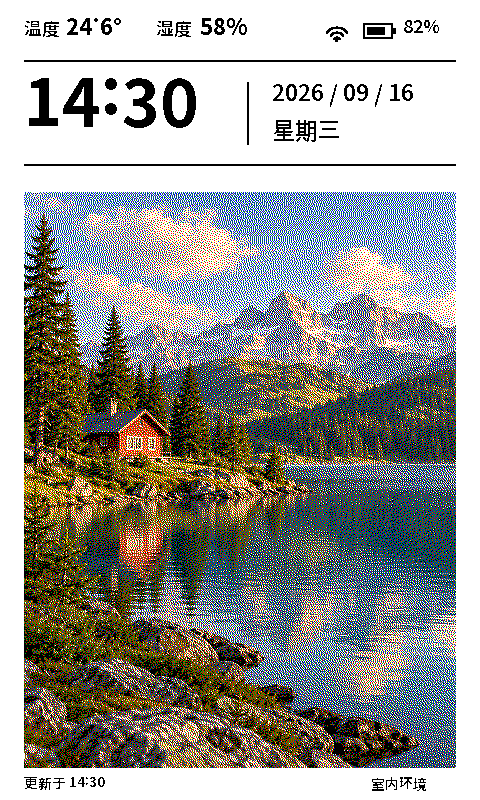

# ESP32 PhotoPainter 桌面相框

为 **Waveshare ESP32-S3-PhotoPainter（7.3 英寸 E6 六色、800×480、16 MB Flash / 8 MB PSRAM）**制作的独立 ESP-IDF 固件。竖屏界面依次显示温湿度与 Wi-Fi/电池、时间日期、照片；显示面积为 96×160 mm。



照片不是整屏背景：**画布 480×800，照片框 (24,192,432,576)**，其余区域专门绘制界面。传感器故障显示 `--`，时间未校准显示“等待校时”，不会把设计稿示例读数当作实测数据。

## 使用

1. 将 FAT32 SD 卡中的 `config.example.json` 复制为根目录的 `config.json`，填写 Wi-Fi。将 `sdcard/photos/` 复制到卡根目录，或者在 `/photos` 放自己的 JPG、PNG、BMP。
2. 使用 ESP-IDF **v5.5.2** 编译、烧录。SDK 必须安装 ESP32-S3 工具链。

```sh
. "$IDF_PATH/export.sh"
idf.py set-target esp32s3
idf.py build
idf.py -p /dev/cu.YOUR_DEVICE flash monitor
```

3. 上电后尝试连网校时，显示界面，进入深睡眠。默认每 **300 秒**重新采样和全屏刷新。屏幕刷新约 25 秒，会闪烁，不能作为逐秒时钟。
4. **休眠时按 BOOT：下一张照片；按 KEY：刷新当前照片。** 刷新期间的按键不排队。照片按文件名排序，定时刷新保持当前照片。冷启动从第一张开始，深睡眠保留索引。

没有检测到连接的实物硬件时，本项目只验证编译和主机渲染；烧录后的颜色、物理朝向、RTC、供电与休眠电流还需要实机验收。

## 图片尺寸兼容性

| 输入 | 行为 |
| --- | --- |
| 旧图 800×480 / 480×800 | 作为原始照片缩放到新照片框，不按旧画布直接写屏 |
| 新图 432×576 | 直接适配照片框 |
| 横图、竖图、方图、奇数宽度 | `cover` 等比居中裁切；`contain` 等比完整显示、白色留边 |
| JPG/JPEG | 基线和渐进 JPEG；读取 EXIF 方向 1–8，包括镜像 |
| PNG | RGB / RGBA / 灰度；透明像素合成到白底；PNG 的 EXIF 方向请先用转换工具规范化 |
| BMP | 使用 stb_image 支持的常见未压缩位图；不依赖宽度是 4 的倍数 |
| 大图 | 头信息检查：单边 ≤4096、总像素 ≤2,000,000，文件 ≤8 MiB；超限拒绝并显示占位或下一张 |
| 解码内存不足、损坏、缺失 | 记录原因并跳过；每轮最多尝试 8 张，不影响界面边界 |

**2 MP 是拒绝阈值，不是所有格式都能在 8 MB PSRAM 中解码的保证**：PNG/JPEG 解码还有临时内存开销。推荐用下面工具生成 **432×576** 的输入，节约内存和耗电。它自动纠正手机 EXIF 方向、处理透明度，使用高质量 Lanczos 缩放。

```sh
python3 -m pip install -r tools/requirements.txt
# 单张：输出到指定文件，格式由扩展名决定
python3 tools/prepare_photo.py original.jpg sdcard/photos/my-photo.png
# 整个目录：当前层的图片，默认输出 PNG
python3 tools/prepare_photo.py ./my-photos ./sdcard/photos
# 包含子目录，转换为 24-bit RGB BMP，保留整张照片并留白
python3 tools/prepare_photo.py ./my-photos ./sdcard/photos --recursive --format bmp --fit contain
# 不指定输出位置：生成同级的 original_prepared / my-photos_prepared 目录
python3 tools/prepare_photo.py original.jpg
```

输出固定为 **432×576 RGB**；可用 `--format png|jpg|jpeg|bmp`。PNG 默认无损，JPEG 输出为基线 JPEG；六色转换由固件负责，不需要预先抖动。指定单个输出文件时，`--format` 必须与扩展名一致。

- 默认 `--fit cover`：等比缩放后居中裁切；`--fit contain`：保留完整图片、白色留边，不拉伸。
- 输入支持 Pillow 已安装的图片格式，例如 JPEG、PNG、BMP、WebP、TIFF、GIF；动画仅取第一帧。HEIC 等额外格式需要相应 Pillow 解码插件。
- `--recursive` 会把子目录中的图片**平铺**到输出目录，因为固件只扫描照片目录当前层。重名输出自动添加 `-2`、`-3`，同时考虑大小写冲突。
- 默认跳过已有输出，使用 `--overwrite` 才替换；始终拒绝覆盖原始输入文件。目录输入和输出不能是同一目录；输出目录可在输入目录内，扫描时会排除它。
- 单张损坏不会中断其他文件；结束时显示成功、跳过、失败数量。有转换失败或没有找到图片时退出码为 1，参数错误为 2。
- 输出直接复制到 SD 卡的 `/photos` 即可。脚本没有修改固件，已有烧录版本可直接使用。

不要把带有时间/状态栏的旧“完整界面截图”当作照片导入，否则这些文字也会出现在照片框里；应使用原始照片。旧 Waveshare `/06_user_Foundation_img` 目录仍可读取（仅在 `/photos` 没有图片时回退），跳过 `sys_decode.bmp`。最多扫描 256 张，推荐文件名使用英文字母与数字。先关机再插拔 SD 卡。

## 配置

```json
{
  "wifi_ssid": "YOUR_WIFI",
  "wifi_password": "YOUR_PASSWORD",
  "timezone": "CST-8",
  "ntp_server": "pool.ntp.org",
  "refresh_seconds": 300,
  "photo_fit": "cover",
  "rotate_180": false,
  "temperature_offset": 0.0
}
```

- `timezone`：POSIX TZ，默认中国标准时间 UTC+8。RTC 中保存 UTC，显示时转换。
- `refresh_seconds`：60–86400；默认 300。包含屏幕刷新时间，但下次唤醒后的连接、解码仍会增加间隔，因此不是整点精确刷新。时间表示采样时刻，显示完成时已过去约 25 秒。
- `photo_fit`：`cover` 或 `contain`。未知值回退 `cover`。
- `rotate_180`：整块竖屏旋转 180 度，以适配摆放方向。
- `temperature_offset`：摄氏度校准偏移，范围 -20～20；没有擅自应用官方示例固定的 -4°C 修正。
- Wi-Fi 图标表示本轮采样时是否连网成功。联网结束后关闭无线并进入深睡眠；不是持续连接状态。
- Wi-Fi 未配置/失败：仍显示照片，RTC/深睡眠时钟有效时继续显示时间。首次无有效时间时显示“等待校时”。
- 无电池或读取失败显示 `--`。固件保留原有充电电流配置，不自行改动电池充电参数。
- `config.json` 可能包含网络凭据，已被 `.gitignore` 排除；仅提交空白模板。修改后重启生效。

## 验证与预览

```sh
python3 -m pip install -r tools/requirements.txt
./tests/run.sh
```

测试使用与固件相同的 C++ 图像解码、缩放、六色抖动、界面和打包逻辑，开启 AddressSanitizer/UndefinedBehaviorSanitizer。包括老尺寸与新尺寸、奇数宽高、1×1、透明 PNG、EXIF 1–8、截断/异常文件、超限图片、画框越界、双向屏幕旋转。生成 `host-build/firmware-preview.png`。

```sh
# 用你的照片预览实际渲染器（先运行测试完成主机程序构建）
host-build/test_frame photo.jpg host-build/my-preview.ppm contain ui
```

这里的 RGB 六色是算法名义色，实际 E6 纸面颜色由面板和环境决定，预览不是实屏测色。文字使用黑白 1bpp，不做彩色抖动。

GitHub Actions 自动进行主机测试与 ESP-IDF 构建，并保存烧录文件。

## 结构

- `components/frame/`：无硬件依赖的像素布局、字体、图片兼容层、色彩转换和面板打包。
- `main/`：SD、配置、联网校时、PCF85063 RTC、SHTC3、PMIC、SPI 显示与深睡眠。
- `tools/prepare_photo.py`：输入照片规范化。
- `sdcard/`：空白配置模板和一张 AI 生成的示例风景照片。
- `docs/`：布局与硬件验收记录。

## 来源

参考 [Waveshare 官方工程](https://github.com/waveshareteam/ESP32-S3-PhotoPainter)，固定版本 **a5e8f757ba0cafbb5586f07d3e83bda3184c0845**。移植了 `components/port_bsp/display_bsp.cpp` 的屏幕初始化/刷新序列以及板级接线；没有引入整个语音/AI 应用。

解码器为 [stb_image](https://github.com/nothings/stb) `2c980bb59875b0d32144a71867fbdebb2f77cd20`；PMIC 库来自上述 Waveshare 快照。中文点阵是 Noto Sans SC 的子集（SIL OFL 1.1）；可通过 `tools/generate_fonts.py FONT.ttf OUTPUT.h` 重新生成。上游许可保留在 `third_party/` 和源文件中。新代码采用 MIT 许可。
