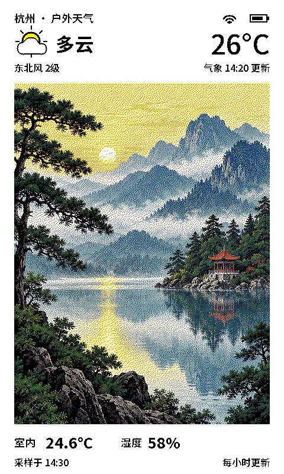

# ESP32 PhotoPainter 桌面相框

为 **Waveshare ESP32-S3-PhotoPainter（7.3 英寸 E6 六色、800×480、16 MB Flash / 8 MB PSRAM）**制作的独立 ESP-IDF 固件。竖屏顶部显示当地天气，中央显示照片，底部显示板载传感器的室内温湿度与采样时间；默认每小时更新。



照片不是整屏背景：**画布 480×800，照片框 (24,140,432,576)**。顶部室外天气与底部室内读数分开显示；传感器故障显示 `--`，时间未校准显示“等待校时”。

## 使用

1. 将 FAT32 SD 卡中的 `config.example.json` 复制为根目录的 `config.json`，填写 Wi-Fi。将 `sdcard/photos/` 复制到卡根目录，或者在 `/photos` 放自己的 JPG、PNG、BMP。
2. 使用 ESP-IDF **v5.5.2** 编译、烧录。SDK 必须安装 ESP32-S3 工具链。

```sh
. "$IDF_PATH/export.sh"
idf.py set-target esp32s3
idf.py build
idf.py -p /dev/cu.YOUR_DEVICE flash monitor
```

3. 上电后尝试连网校时、获取天气，显示界面并进入深睡眠。默认白天每 **10800 秒（3 小时）**重新采样和全屏刷新，00:00–07:00 暂停自动刷新。屏幕刷新约 25 秒，会闪烁；界面显示采样时间，不显示实时钟。
4. **休眠时按 BOOT：下一张照片；短按 KEY：刷新界面；长按 KEY 约 3 秒：强制换一张照片。** KEY 唤醒后持续按住 2 秒判定长按，加上启动时间建议总共按住约 3 秒；无需等屏幕刷新后才松手。每次唤醒最多换一张，刷新过程中不排队处理按键。配置 NAS 服务后，默认每 3 小时换一张收藏照片，BOOT 或 KEY 长按可立即请求新照片；每小时仍更新天气和室内读数。未配置 NAS 时，换图操作切到下一张 SD 照片。

没有检测到连接的实物硬件时，本项目只验证编译和主机渲染；烧录后的颜色、物理朝向、RTC、供电与休眠电流还需要实机验收。

## 图片尺寸兼容性

| 输入 | 行为 |
| --- | --- |
| 旧图 800×480 / 480×800 | 作为原始照片缩放到新照片框，不按旧画布直接写屏 |
| 新图 432×576 | 直接适配照片框 |
| 横图、竖图、方图、奇数宽度 | `cover` 等比居中裁切；`contain` 等比完整显示、白色留边 |
| JPG/JPEG | 基线和渐进 JPEG；读取 EXIF 方向 1–8，包括镜像 |
| PNG | RGB / RGBA / 灰度；透明像素合成到白底；PNG 的 EXIF 方向请先用转换工具规范化 |
| BMP | 使用 stb_image 支持的常见未压缩位图；不依赖宽度是 4 的倍数 |
| 大图 | 头信息检查：单边 ≤4096、总像素 ≤2,000,000，文件 ≤8 MiB；超限拒绝并显示占位或下一张 |
| 解码内存不足、损坏、缺失 | 记录原因并跳过；每轮最多尝试 8 张，不影响界面边界 |

**2 MP 是拒绝阈值，不是所有格式都能在 8 MB PSRAM 中解码的保证**：PNG/JPEG 解码还有临时内存开销。推荐用下面工具生成 **432×576** 的输入，节约内存和耗电。它自动纠正手机 EXIF 方向、处理透明度，使用高质量 Lanczos 缩放。

```sh
python3 -m pip install -r tools/requirements.txt
# 单张：输出到指定文件，格式由扩展名决定
python3 tools/prepare_photo.py original.jpg sdcard/photos/my-photo.png
# 整个目录：当前层的图片，默认输出 PNG
python3 tools/prepare_photo.py ./my-photos ./sdcard/photos
# 包含子目录，转换为 24-bit RGB BMP，保留整张照片并留白
python3 tools/prepare_photo.py ./my-photos ./sdcard/photos --recursive --format bmp --fit contain
# 不指定输出位置：生成同级的 original_prepared / my-photos_prepared 目录
python3 tools/prepare_photo.py original.jpg
```

输出固定为 **432×576 RGB**；可用 `--format png|jpg|jpeg|bmp`。PNG 默认无损，JPEG 输出为基线 JPEG；六色转换由固件负责，不需要预先抖动。指定单个输出文件时，`--format` 必须与扩展名一致。

- 默认 `--fit cover`：等比缩放后居中裁切；`--fit contain`：保留完整图片、白色留边，不拉伸。
- 输入支持 Pillow 已安装的图片格式，例如 JPEG、PNG、BMP、WebP、TIFF、GIF；动画仅取第一帧。HEIC 等额外格式需要相应 Pillow 解码插件。
- `--recursive` 会把子目录中的图片**平铺**到输出目录，因为固件只扫描照片目录当前层。重名输出自动添加 `-2`、`-3`，同时考虑大小写冲突。
- 默认跳过已有输出，使用 `--overwrite` 才替换；始终拒绝覆盖原始输入文件。目录输入和输出不能是同一目录；输出目录可在输入目录内，扫描时会排除它。
- 单张损坏不会中断其他文件；结束时显示成功、跳过、失败数量。有转换失败或没有找到图片时退出码为 1，参数错误为 2。
- 输出直接复制到 SD 卡的 `/photos` 即可。脚本没有修改固件，已有烧录版本可直接使用。

不要把带有时间/状态栏的旧“完整界面截图”当作照片导入，否则这些文字也会出现在照片框里；应使用原始照片。旧 Waveshare `/06_user_Foundation_img` 目录仍可读取（仅在 `/photos` 没有图片时回退），跳过 `sys_decode.bmp`。最多扫描 256 张，推荐文件名使用英文字母与数字。先关机再插拔 SD 卡。

## 配置

```json
{
  "wifi_ssid": "YOUR_WIFI",
  "wifi_password": "YOUR_PASSWORD",
  "timezone": "CST-8",
  "ntp_server": "pool.ntp.org",
  "refresh_seconds": 10800,
  "quiet_hours_enabled": true,
  "quiet_hours_start": 0,
  "quiet_hours_end": 7,
  "photo_service_url": "http://192.168.31.133:11280/photo.jpg",
  "photo_service_token": "YOUR_SERVICE_TOKEN",
  "photo_refresh_seconds": 10800,
  "weather_adcode": "",
  "photo_fit": "cover",
  "rotate_180": false,
  "temperature_offset": 0.0
}
```

- `timezone`：POSIX TZ，默认中国标准时间 UTC+8。RTC 中保存 UTC，显示时转换。
- `refresh_seconds`：10800–86400；默认 10800（3 小时），同时更新天气、室内温湿度及屏幕。旧配置中小于 10800 的间隔自动提升为三小时，无需重新复制 SD 卡上的 Wi-Fi 配置。联网、解码仍会增加少量时间，因此不是整点精确刷新。
- `quiet_hours_enabled`：默认 `true`，暂停时段不联网取天气/照片、不采样、不刷新屏幕，保留最后画面，直接睡到暂停结束。长按 KEY 或按 BOOT 可手动更新；短按 KEY 在暂停时段不刷新。时钟未校准时先尝试联网校时，成功后重新判断是否需要暂停。
- `quiet_hours_start` / `quiet_hours_end`：本地时区的整点小时（0–23），默认 `0` 和 `7`，即 `[00:00, 07:00)`；支持 `23` 到 `7` 的跨午夜时段，两者相同表示不暂停。设 `quiet_hours_enabled: false` 可全天自动更新。
- `weather_adcode`：六位行政区划代码，例如北京市 `"110000"`；不是邮政编码。填写时优先按该地区查询；留空按设备公网 IP 定位。IP 定位可能对应网络出口城市。
- 天气使用 [UApiPro 天气接口](https://uapis.cn/docs/api-reference/get-misc-weather)，HTTPS 校验证书，仅读取基础天气字段。顶部显示接口的气象数据时间，底部显示室内传感器的采样时间。支持接口返回的绝对时间及“几分钟前发布”。
- 天气请求失败时，在深睡眠保留的缓存上显示“未更新”和原始气象时间；缓存超过 24 小时或定位配置改变后不再使用。冷启动没有缓存时显示“暂无天气”。不影响本地照片与室内温湿度。
- `photo_fit`：`cover` 或 `contain`。未知值回退 `cover`。
- `photo_service_url`：NAS 取图接口，留空禁用联网取图。支持 HTTP/HTTPS，HTTPS 验证服务器证书；不跟随重定向。局域网服务示例见上方。
- `photo_service_token`：与 NAS 服务 `api_token` 一致（24–256 个非空白 ASCII 字符），以 Bearer 请求头发送，不打印到串口日志。
- `photo_refresh_seconds`：照片更换间隔，默认 10800 秒（3 小时），范围 3600–604800；在每次设备唤醒时检查是否到期。天气和传感器按 `refresh_seconds` 一同更新，夜间暂停自动取图；若将设备唤醒间隔设置得更长，照片也只能在唤醒时更新。
- NAS 图片缓存到 SD 卡隐藏目录 `/.nasphoto/` 的两个文件，先写备用文件、验证 JPEG 及 432×576 尺寸，再记录新选择。支持 Content-Length 和 chunked 响应，最多下载 1 MiB；下载失败、网络断开时保留原有缓存，下次唤醒重试。没有缓存时回退 SD 本地照片。需要可写的 SD 卡。
- 缓存选择和最近成功取图时间保存在 NVS，深睡眠及重启后继续使用；按 BOOT 或长按 KEY 立即尝试换图，短按 KEY 仅在正常到期时换图。请求失败保留缓存照片，不会推进照片计时。持续按住按键不会连续触发刷新。
- `rotate_180`：在当前默认安装方向上再旋转 180 度。默认方向已整体翻转，以适配用户当前摆放方式；现有 SD 配置无需修改。本选项仍可用于反向摆放。
- `temperature_offset`：摄氏度校准偏移，范围 -20～20；没有擅自应用官方示例固定的 -4°C 修正。
- Wi-Fi 图标表示本轮采样时是否连网成功。联网结束后关闭无线并进入深睡眠；不是持续连接状态。
- Wi-Fi 未配置/失败：仍显示照片和室内读数；天气按上述缓存策略显示。RTC/深睡眠时钟有效时保留采样时间，首次无有效时间时显示“等待校时”。
- 电池图标旁显示 AXP2101 电量计读取的 `0–100%`；无电池或读取失败显示 `--%`。百分比随界面刷新更新，属于电量计估算。固件保留原有充电电流配置，不自行改动电池充电参数。
- `config.json` 可能包含网络凭据，已被 `.gitignore` 排除；仅提交空白模板。修改后重启生效。

### 本地刷机包的默认 NAS 配置

如需保留设备现有 SD 卡 Wi-Fi 配置，可创建被 Git 忽略的 `main/photo_service_private.h`：

```cpp
#pragma once
#define PHOTO_SERVICE_URL "http://192.168.31.133:11280/photo.jpg"
#define PHOTO_SERVICE_TOKEN "YOUR_SERVICE_TOKEN"
```

本地编译时将其作为默认值；SD 卡中显式填写的 `photo_service_url`、`photo_service_token` 优先，显式空 URL 可禁用。仓库及 CI 不带此文件，普通构建默认仍使用 SD 本地照片。包含私有默认值的固件二进制也包含接口密钥，不上传公共构建产物。

## 节电策略

- 保留每小时天气/传感器刷新、每 3 小时照片更换，不启用夜间暂停。
- 照片六色结果缓存到 SD 卡 `/.nasphoto/render.bin`（约 122 KiB）。照片内容、裁剪方式或缓存格式改变时重新解码和抖动；正常每小时刷新只复用照片区域，天气、读数和电量仍重新绘制。缓存校验失败自动重建，缓存无法写入时仍正常显示照片。
- 冷启动或时钟无效时进行 NTP 校时；深睡眠期间保留校时记录，成功后 24 小时内跳过重复校时。单次等待最多约 8 秒，失败在下一次唤醒重试。
- 深睡眠保存最近热点的 BSSID/频道，下次先尝试快速连接（最多 5 秒），失败后完整扫描（最多 12 秒）。没有热点缓存时只做一次最多 12 秒的连接尝试。
- 按官方原理图，ALDO3 标为 `Audio_VCC`，但实机关闭后 RTC/SHTC3 的 I²C 通信异常，因此保留供电，将音频功放控制脚置低，并检查 ES8311/ES7210 的软件休眠寄存器，必要时写入休眠序列并读回验证（详见 [音频低功耗说明](docs/audio-power.md)）；ALDO4 为 `EPD_VCC`，每次唤醒恢复，刷新结束后关闭。屏幕信号脚在休眠时保持低电平，避免经 GPIO 向断电屏幕反向供电。电源寄存器修改保留其他电源使能位，并读回确认。
- SD 卡与 ESP32 共用 DCDC1，保留主电源；完成文件操作后卸载 SD，释放 SDMMC/SPI 总线及无用引脚上拉。RTC 电源和 BOOT/KEY 唤醒保留，充电参数不变。
- 串口记录照片渲染/缓存读取耗时、总唤醒耗时及外设电源关闭结果。编译、主机测试不能代替整板电流测量；刷机后需确认再次唤醒能恢复屏幕和 SD，并在电池供电下对比休眠电流。

电源连线依据：[微雪官方原理图](https://files.waveshare.com/wiki/ESP32-S3-PhotoPainter/ESP32-S3-PhotoPainter-Schematic.pdf)。

## 验证与预览

```sh
python3 -m pip install -r tools/requirements.txt
# Linux 主机天气解析测试需要 libcjson-dev 和 pkg-config
./tests/run.sh
```

测试使用与固件相同的 C++ 图像解码、缩放、六色抖动、界面和打包逻辑，开启 AddressSanitizer/UndefinedBehaviorSanitizer。包括老尺寸与新尺寸、奇数宽高、1×1、透明 PNG、EXIF 1–8、截断/异常文件、超限图片、画框越界、双向屏幕旋转。生成 `host-build/firmware-preview.png`。

```sh
# 用你的照片预览实际渲染器（先运行测试完成主机程序构建）
host-build/test_frame photo.jpg host-build/my-preview.ppm contain ui
```

这里的 RGB 六色是算法名义色，实际 E6 纸面颜色由面板和环境决定，预览不是实屏测色。文字使用黑白 1bpp，不做彩色抖动。

GitHub Actions 自动进行主机测试与 ESP-IDF 构建，并保存烧录文件。

## 结构

- `components/frame/`：无硬件依赖的像素布局、字体、图片兼容层、色彩转换和面板打包。
- `main/`：SD、配置、联网校时、PCF85063 RTC、SHTC3、PMIC、SPI 显示与深睡眠。
- `tools/prepare_photo.py`：输入照片规范化。
- `sdcard/`：空白配置模板和一张 AI 生成的示例风景照片。
- `docs/`：布局与硬件验收记录。

## 来源

参考 [Waveshare 官方工程](https://github.com/waveshareteam/ESP32-S3-PhotoPainter)，固定版本 **a5e8f757ba0cafbb5586f07d3e83bda3184c0845**。移植了 `components/port_bsp/display_bsp.cpp` 的屏幕初始化/刷新序列以及板级接线；没有引入整个语音/AI 应用。

解码器为 [stb_image](https://github.com/nothings/stb) `2c980bb59875b0d32144a71867fbdebb2f77cd20`；PMIC 库来自上述 Waveshare 快照。中文点阵是 Noto Sans SC 的子集（SIL OFL 1.1）；可通过 `tools/generate_fonts.py FONT.ttf OUTPUT.h` 重新生成。上游许可保留在 `third_party/` 和源文件中。新代码采用 MIT 许可。


### 照片清晰度处理

新版 NAS 服务在缩放到 432×576 后做轻度亮度曲线、对比度和亮度通道锐化；可通过
`image_processing` 调整或关闭，详见 [服务端说明](nas-service/README.md#photo-clarity-processing)。
新版固件采用蛇形误差扩散，旧六色缓存自动失效。布局和六色调色板保持原样，
没有未经实测就替换屏幕颜色参数。服务端和固件需分别更新，电脑预览不能代替实屏对比。


### 当前布局：信息置顶、大图

天气、室内温湿度、采样时间和更新间隔集中在顶部；照片区域为 **456×656**，坐标 `(12,132)`，左右及底部留白 12 像素，比原 432×576 增加 20.2% 面积。照片比例有所变化，cover 会重新裁切；contain 保留完整照片并留白。
本地图片准备工具按新尺寸输出。NAS 镜像使用 `20260919-topinfo`，固件自动协商新尺寸；旧服务返回的 432×576 图片仍可显示，但会缩放、裁切。六色缓存自动失效重建。
